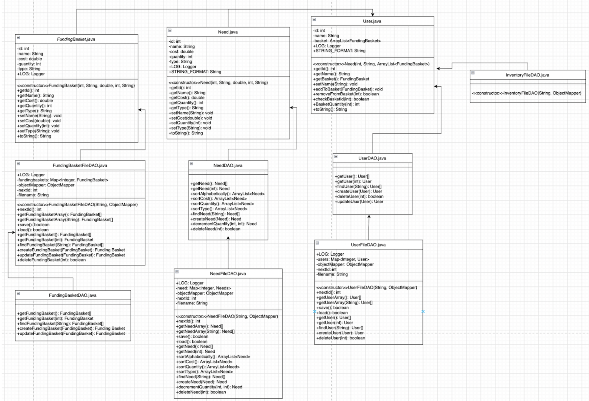
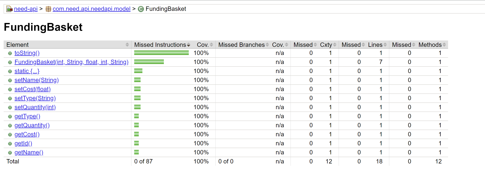

# PROJECT Design Documentation

## Team Information
* Team name: Team 7G
* Team members
  * Zara Khan
  * Eliana Durell
  * Jade Kimmel
  * Abhijay Kheechee

## Executive Summary

Our team is creating a fully-implemented site called Homie Helper where users can purchase items to donate to homeless individuals in need. Items include: 
* Clothing
* Toiletries
* Food

The site will utilize persistence, updating quantities and prices as per user purchases and admin changes. Users will have the ability to sort items by various properties (price, quantity, A-Z) and (potentially) toggle dark-mode.

### Purpose
An E-store that enables users to purchase products to donate to homeless individuals in need, and recieve discount codes if they are returning customers. Admins have the ability to add and change item quantities and prices at their own discretion.

### Glossary and Acronyms

| Term | Definition |
|------|------------|
| Front-end | Portion of application user can view and interact with |
| Back-end | Portion of application that handles functionality |
| Angular | Javascript library involved with handling front-end |
| REST APIs | Set of standards for application interface |
| Controllers/DAOs | Java classes that deal with front-end and back-end communication |
| Trello | Kanban-style project management tool used by team |
| CURL Commands | Set of commands that allow HTTP requests (get, create, delete, update, search) |

## Requirements

### Definition of MVP
* User can create and log into account
* User can browse or search site inventory and add items to cart
* User can view their shopping cart
* User can purchase products in shopping cart
* Admin can log in and view admin dashboard
* Admin can edit product inventory (items, quantities, prices, etc.)

### MVP Features
* Need
  * Create new need
  * Search for needs
  * Delete a single need
  * Update a need
  * Get a single need
* Get entire cupboard
* Funding basket
* Checkout
* Admin
* Helper
* Login/Logout

### Enhancements

#### Sort
* Our first 10% enhancement enables users to sort through needs.
* When a user clicks on one of the sorting options, the sorted corresponding list of items is returned/displayed.
* Sorts include price (low-high), price (high-low), quantity (low-high), quantity (high-low), and alphabetical.

#### Responsive Design
* Our second 10% enhancement enables the UI to responsively fit to the size of the user's window.
* As the user changes the size of their window, the UI actively resizes.
* This enables our e-store to be displayed on both desktop and mobile devices.

## Application Domain

This section describes the application domain.

## Architecture and Design

This section describes the application architecture.

### Summary
The following Tiers/Layers model shows a high-level view of the webapp's architecture. 

The web application, is built using the Model–View–ViewModel (MVVM) architecture pattern. 

The Model stores the application data objects including any functionality to provide persistance. 

The View is the client-side SPA built with Angular utilizing HTML, CSS and TypeScript. The ViewModel provides RESTful APIs to the client (View) as well as any logic required to manipulate the data objects from the Model.

Both the ViewModel and Model are built using Java and Spring Framework. Details of the components within these tiers are supplied below.

### Overview of User Interface
This section describes the web interface flow; this is how the user views and interacts with the web application.

* The user is first brought to the launch page titled "Homie Helper Home page." Here, there is a "Login" button located in the top left corner that they can click.
* The user is then brought to the login page. On this page is a heading stating "Enter your credentials" with two input bars underneath.
  * The first bar prompts the user for their username.
  * The second prompts for their password.
  * Under the two input bars is a grey "Login" button located in the center. The user will click this after entering the required information.
* If the user is a helper: 
  * The user is brought to the "Product Dashboard" page. In the top left of the screen there are two buttons located on the nav-bar titled "Logout" and "Shopping Cart." 
    * If the user clicks "Logout," they are logged out and led back to the landing page.
    * If the user clicks "Shopping Cart," they are brought to the shopping cart page.
      * The page reads "Shopping Cart" in the center, with a "Logout" button located on the navbar in the top left corner. Each need in the user's cart is listed here, with its name on top and quantity below it, and three buttons next to that: +1, -1, and a trash can icon.
        * Clicking the +1 or -1 increments or decrements the quantity. It is updated on the need property.
        * If the trash can is pressed, the need is removed from the cart and disappears from the page.
      * At the bottom of the page reads "The current user's total is:" with the user's calculated total next to it.
      * Beneath that are two buttons: "Go back" and "Checkout."
        * Selecting "Go back" brings you back to the Product Dashboard.
        * Selecting Checkout clears the needs out from your shopping cart and empties it if there are >= 1 needs in the cart. If there aren't, an error message appears at the top of the user's screen indicating that their cart is empty.
    * Included on this page are also all featured needs.
      * If the user clicks on one, they are brought to the need details page, which displays the need's id, name, cost, quantity, and type. It includes two buttons at the bottom: "Go back" and "Add to Cart"
        * If the user selects "Go back," they are brought back to the product dashboard.
        * If the user selects "Add to Cart" the need is added to their cart if quantity > 0. Otherwise, an error at the top of the user's screen is returned indicating that the item cannot be added to cart at this time.
    * There are also five sort buttons, along with a "Product Search" bar beneath them.
      * Clicking on each sort button returns a corresponding list of sorted needs that appears under the search bar.
      * Searching up an existing need in the "Product Search" bar returns the need directly under the bar. If clicked, the user will be brought to the corresponding need detail page
* If the user is an admin:
  * The admin will be brought to the "Manage Products" page. In the top left is a "Logout" button on the navbar.
    * If clicked, the admin will be logged out and brought back to the landing page.
  * Beneath the title of the page are fields allowing an admin to enter a "New Product," including "Name," "Cost," "Quantity," and "Type."
    * If all fields are properly filled out, the admin can press the "Add product" button beneath the input bars, effectively adding the need to the list of needs in the cupboard at the bottom of the page.
    * If the admin selects a need from that list, they are brought to the "Product Details" page.
      * Here, the admin can modify the aforementioned properties of the selected existing need. Details include id (unmodifiable), cost, quantity, type, and name, each with their own input bars containing their respective value.
      * At the bottom are two buttons: "go back" and "save."
        * Selecting "go back" brings the admin back to the Manage Products page.
        * Selecting "save" saves the admin's changes to the need and updates its values.

### View Tier

Above is an example of an admin attempting to add or modify a need to the cupboard. First, an add() command is sent from the admin to Need when creating a new need. If all fields are filled out, the entered properties are saved to NeedDetail using the save() command, and the Need is effectively added to the Cupboard using addNeed(Need). If all properties are not correctly filled out, then Need returns an error back to the admin.
Similarly, when modifying an exitsing need, a request is sent from the admin to NeedDetail to save() their changes. If any fields are incorrectly filled or empty, NeedDetail returns an erorr back to the admin. Otherwise, the admin's request is recieved, and an updateNeed(Need) request is successfully sent to the Cupboard.

This second example depicts the interactions betwene the Cupboard and FundingBasket entities when a user adds an item to the cart. By selecting addToCart(), the user is sending a getNeed() request to the Cupboard. If the need exists and has a quantity > 0, an addToCart(Need) request is sent to the FundingBasket, effectually adding the item to the user's cart. Otherwise, an error is returned to the user indicating that the need was unable to be added to the cart.

### ViewModel Tier
The ViewModel Tier covers our controller classes, which allow for communication between the back and front-ends of our application. The CheckoutController, FundingBasketController, NeedController, and UserController classes are each responsible for handling HTTP requests relating to their corresponding entities (Checkout, FundingBasket, Need, and User).

As shown above, the ViewModelTier encompasses the four controllers: Need, Checkout, User, and FundingBasket. The CheckoutController utilizes both the UserDAO and the NeedDAO which access the user’s fundingbasket. The NeedController utilizes Need and NeedDAO. Similarly, the FundingBasketController utilizes FundingBasket and FundingBasketDAO, and the UserController utilizes User and UserDAO. The controller cannot directly interact with the database which is why it utilizes the model and DAO. The model represents the domain logic and data, and the DAO encapsulates access to the database. There are three models, the fundingbasket, need, and user, as they are main parts of the application. The CheckoutController does not have its own model or DAO as it relies on the user which has access to the fundingbasket, and the need which has access to the inventory.

### Model Tier
Several foundational classes make up the Model Tier of our application, including Need, User, and FundingBasket. Each of these have their own sets of appliable attributes, including IDs and names, as well as getters and setters that allow these values to be modified.

In addition, DAO (Data Access Object) files such as FundingBasketDAO, InventoryDAO, NeedDAO, and UserDAO provide interfaces that allow the migration of data between classes, and convert JSON scripts into their own respective objects. This allows for persistence within the application, as updates in app data are stored using these interfaces.

Depicted above is the Model Tier, which encompasses FundingBasket, Need, and User backend files. User.java uses FundingBasket.java and Need.Java because a User has a Funding Basket Object that contains a list of Need Objects. In order for a User to navigate through the website it uses User.java and UserDAO.java methods. UserDAO.java is a blueprint for UserFileDAO.java to implement. This includes getting, updating, and finding a User. It also has methods that allow the user to access the Funding Basket. The User uses the FundingBasket files to remove, edit, and delete needs. When a user does this they update their FundingBasket. The Need files are so the User can view the Needs in their FundingBasket.  

## OO Design Principles

### Low Coupling
Low coupling involves the structuring of classes in such a way that contains the functionality and responsibility of an object without interfering with other objects. We implemented this principle by separating object/class functionalities: our User, Need, FundingBasket, and Checkout classes each contain their own constructiors, getters, and setters that are unreadable by external classes. Instead, any interactions between classes are handled by another separate class that was solely made for this purpose.

### Controller
The controller specifies a separation of concerns between the user-interface and other system components by assigning responsibilities to recieve and coordinate system operations to a class outside of the UI, and acts as a mediator between the front and back-ends. In our application, the CheckoutController, FundingBasketController, NeedController, and UserController classes are used to handle and execute such operations. For instance, if a user selects a need, the NeedController class handles the HTTP requests (i.e. get) and displays the need on the front-end.

### Dependency Inversion/Injection
Dependency inversion entails that high-level modules should not depend on low level modules: rather, both should depend on abstractions, providing a looser coupling between dependent entities. The main way by which we utilize this in our application is through our DAO (Data Access Object) classes. Each DAO file has a respective abstract DAO file that provides an interface for the implementation files to follow. This allows us to not only test our DAO files with mock classes but also completely change our implementations without affecting any classes external to the one being injected.  

### Pure Fabrication
Pure fabrication deals with the use of services that access certain capabilities to be reused as needed across the program. We implemented this using the ProductService, UserService, and CurrentUserService classes. ProductService, located in the product.service.ts file, handles requests to fetch and manipulate the properties of products for components such as product-list and product-search. Similarly, UserService deals with requests to log in existing users or create new user accounts. Finally, CurrentUserService is used to store information regarding the currently logged in user. All three of these classes help to maintain persistence throughout the program.

## Static Code Analysis/Future Design Improvements

### User
.png)
* Using a list is an interface whereas ArrayList is a class. ArrayList implements List, so using List may have been better.

### FundingBasketFileDAO
.png)
* We had a lot of imports that were unnecessary which made the code messy
* There were also a good amount of comments that we did not need as they were unclear and more for our thought process of how to code the function

### NeedController
.png)
* We had extra code that was not needed

### FundingBasketDAO
.png)
* The order was not correct with the java language, it may make it more difficult for another person to view and understand

### Future Potential Refactoring & Design Improvements

#### View Tier
* Allow admin to view all the users and when a new user is created
* Allow admin to see profits from cupboard
* When adding a need and not all fields are filled out, indicate which field(s) require attention

#### Usability

## Testing

### Acceptance Testing

#### Sprint 2
* There are 4 user stories from this sprint that have passed their acceptance criteria tests (Funding Basket (8), Get Entire Cupboard (5), Checkout (8), Helper (13)).
* There are 2 user stories from this sprint that have some failing acceptance criteria (Admin (13), Login/Logout (8)). Need to create logging in permissions specific to users/admins.

#### Sprint 4
* All 12 user stories have passed their acceptance criteria tests. There are no issues or concerns at this time.

### Unit Testing and Code Coverage
Our testing strategy was to reach a minimum of 90% coverage for each class. We effectively created tests while we implemented the code itself to avoid missing any tests in the long-run.

#### Anomalies
* FundingBasket's code coverage report is currently a slight anomaly (as of Sprint 2) as there are not yet tests created to cover the setCost(float), setType(String), and setQuanitity(int) methods.
  * Discrepency fixed as of Sprint 3, and sufficient tests have been created.

## Ongoing Rationale
* 2024/04/07: Sprint 3 we decided to scrap our dark mode and discount code 10% enhancement features due to the complexity of implementing them. We are instead sticking with our five sorting features (high quantity, low quantity, high price, low price, alphabetical).
* 2024/04/17: Sprint 4 for our 2nd 10% enchancement we decided to implement a responsive UI design.
