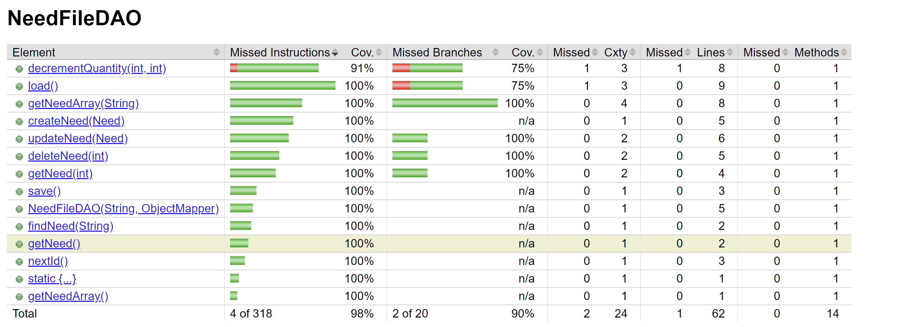

# PROJECT Design Documentation

> _The following template provides the headings for your Design
> Documentation.  As you edit each section make sure you remove these
> commentary 'blockquotes'; the lines that start with a > character
> and appear in the generated PDF in italics but do so only **after** all team members agree that the requirements for that section and current Sprint have been met. **Do not** delete future Sprint expectations._

## Team Information
* Team name: Team 7G
* Team members
  * Zara Khan
  * Eliana Durell
  * Jade Kimmel
  * Abhijay Kheechee

## Executive Summary

Our team is creating a fully-implemented site called Homie Helper where users can purchase items to donate to homeless individuals in need. Items include: 
* Clothing
* Toiletries
* Food

The site will utilize persistence, updating quantities and prices as per user purchases and admin changes. Users will have the ability to sort items by various properties (price, quantity, A-Z) and (potentially) toggle dark-mode.

### Purpose
An E-store that enables users to purchase products to donate to homeless individuals in need, and recieve discount codes if they are returning customers. Admins have the ability to add and change item quantities and prices at their own discretion.

### Glossary and Acronyms

| Term | Definition |
|------|------------|
| Front-end | Portion of application user can view and interact with |
| Back-end | Portion of application that handles functionality |
| Angular | Javascript library involved with handling front-end |
| REST APIs | Set of standards for application interface |
| Controllers/DAOs | Java classes that deal with front-end and back-end communication |
| Trello | Kanban-style project management tool used by team |
| CURL Commands | Set of commands that allow HTTP requests (get, create, delete, update, search) |

## Requirements

This section describes the features of the application.

> _In this section you do not need to be exhaustive and list every
> story.  Focus on top-level features from the Vision document and
> maybe Epics and critical Stories._

### Definition of MVP
* User can create and log into account
* User can browse or search site inventory and add items to cart
* User can view their shopping cart
* User can purchase products in shopping cart
* Admin can log in and view admin dashboard
* Admin can edit product inventory (items, quantities, prices, etc.)

### MVP Features
>  _**[Sprint 4]** Provide a list of top-level Epics and/or Stories of the MVP._

### Enhancements
> _**[Sprint 4]** Describe what enhancements you have implemented for the project._

## Application Domain

This section describes the application domain.

## Architecture and Design

This section describes the application architecture.

### Summary
The following Tiers/Layers model shows a high-level view of the webapp's architecture. 

The web application, is built using the Model–View–ViewModel (MVVM) architecture pattern. 

The Model stores the application data objects including any functionality to provide persistance. 

The View is the client-side SPA built with Angular utilizing HTML, CSS and TypeScript. The ViewModel provides RESTful APIs to the client (View) as well as any logic required to manipulate the data objects from the Model.

Both the ViewModel and Model are built using Java and Spring Framework. Details of the components within these tiers are supplied below.

### Overview of User Interface
This section describes the web interface flow; this is how the user views and interacts with the web application.

> _Provide a summary of the application's user interface.  Describe, from the user's perspective, the flow of the pages in the web application._

### View Tier
> _**[Sprint 4]** Provide a summary of the View Tier UI of your architecture.
> Describe the types of components in the tier and describe their
> responsibilities.  This should be a narrative description, i.e. it has
> a flow or "story line" that the reader can follow._

> _**[Sprint 4]** You must  provide at least **2 sequence diagrams** as is relevant to a particular aspects 
> of the design that you are describing.  (**For example**, in a shopping experience application you might create a 
> sequence diagram of a customer searching for an item and adding to their cart.)
> As these can span multiple tiers, be sure to include an relevant HTTP requests from the client-side to the server-side 
> to help illustrate the end-to-end flow._

> _**[Sprint 4]** To adequately show your system, you will need to present the **class diagrams** where relevant in your design. Some additional tips:_
 >* _Class diagrams only apply to the **ViewModel** and **Model** Tier_
>* _A single class diagram of the entire system will not be effective. You may start with one, but will be need to break it down into smaller sections to account for requirements of each of the Tier static models below._
 >* _Correct labeling of relationships with proper notation for the relationship type, multiplicities, and navigation information will be important._
 >* _Include other details such as attributes and method signatures that you think are needed to support the level of detail in your discussion._

### ViewModel Tier
The ViewModel Tier covers our controller classes, which allow for communication between the back and front-ends of our application. The CheckoutController, FundingBasketController, NeedController, and UserController classes are each responsible for handling HTTP requests relating to their corresponding entities (Checkout, FundingBasket, Need, and User).

> _**[Sprint 4]** Provide a summary of this tier of your architecture. This
> section will follow the same instructions that are given for the View
> Tier above._

> _At appropriate places as part of this narrative provide **one** or more updated and **properly labeled**
> static models (UML class diagrams) with some details such as critical attributes and methods._
> 

### Model Tier
Several foundational classes make up the Model Tier of our application, including Need, User, and FundingBasket. Each of these have their own sets of appliable attributes, including IDs and names, as well as getters and setters that allow these values to be modified.

In addition, DAO (Data Access Object) files such as FundingBasketDAO, InventoryDAO, NeedDAO, and UserDAO provide interfaces that allow the migration of data between classes, and convert JSON scripts into their own respective objects. This allows for persistence within the application, as updates in app data are stored using these interfaces.

> _**[Sprint 2, 3 & 4]** Provide a summary of this tier of your architecture. This
> section will follow the same instructions that are given for the View
> Tier above._

> _At appropriate places as part of this narrative provide **one** or more updated and **properly labeled**
> static models (UML class diagrams) with some details such as critical attributes and methods._
> 

## OO Design Principles

### Low Coupling
Low coupling involves the structuring of classes in such a way that contains the functionality and responsibility of an object without interfering with other objects. We implemented this principle by separating object/class functionalities: our User, Need, FundingBasket, and Checkout classes each contain their own constructiors, getters, and setters that are unreadable by external classes. Instead, any interactions between classes are handled by another separate class that was solely made for this purpose.

### Controller
The controller specifies a separation of concerns between the user-interface and other system components by assigning responsibilities to recieve and coordinate system operations to a class outside of the UI, and acts as a mediator between the front and back-ends. In our application, the CheckoutController, FundingBasketController, NeedController, and UserController classes are used to handle and execute such operations. For instance, if a user selects a need, the NeedController class handles the HTTP requests (i.e. get) and displays the need on the front-end.

### Dependency Inversion/Injection
Dependency inversion entails that high-level modules should not depend on low level modules: rather, both should depend on abstractions, providing a looser coupling between dependent entities. The main way by which we utilize this in our application is through our DAO (Data Access Object) classes. Each DAO file has a respective abstract DAO file that provides an interface for the implementation files to follow. This allows us to not only test our DAO files with mock classes but also completely change our implementations without affecting any classes external to the one being injected.  

> _**[Sprint 2, 3 & 4]** Will eventually address upto **4 key OO Principles** in your final design. Follow guidance in augmenting those completed in previous Sprints as indicated to you by instructor. Be sure to include any diagrams (or clearly refer to ones elsewhere in your Tier sections above) to support your claims._

> _**[Sprint 3 & 4]** OO Design Principles should span across **all tiers.**_

## Static Code Analysis/Future Design Improvements
> _**[Sprint 4]** With the results from the Static Code Analysis exercise, 
> **Identify 3-4** areas within your code that have been flagged by the Static Code 
> Analysis Tool (SonarQube) and provide your analysis and recommendations.  
> Include any relevant screenshot(s) with each area._

> _**[Sprint 4]** Discuss **future** refactoring and other design improvements your team would explore if the team had additional time._

## Testing
> _This section will provide information about the testing performed
> and the results of the testing._

### Acceptance Testing

#### Sprint 2
* There are 4 user stories from this sprint that have passed their acceptance criteria tests (Funding Basket (8), Get Entire Cupboard (5), Checkout (8), Helper (13)).
* There are 2 user stories from this sprint that have some failing acceptance criteria (Admin (13), Login/Logout (8)). Need to create logging in permissions specific to users/admins.

#### Sprint 4

> _**[Sprint 2 & 4]** Report on the number of user stories that have passed all their
> acceptance criteria tests, the number that have some acceptance
> criteria tests failing, and the number of user stories that
> have not had any testing yet. Highlight the issues found during
> acceptance testing and if there are any concerns._

### Unit Testing and Code Coverage
> _**[Sprint 4]** Discuss your unit testing strategy. Report on the code coverage
> achieved from unit testing of the code base. Discuss the team's
> coverage targets, why you selected those values, and how well your
> code coverage met your targets._
>_**[Sprint 2 & 4]** **Include images of your code coverage report.** If there are any anomalies, discuss
> those._

#### Anomalies
* FundingBasket's code coverage report is currently a slight anomaly (as of Sprint 2) as there are not yet tests created to cover the setCost(float), setType(String), and setQuanitity(int) methods.

## Ongoing Rationale
* 2024/04/07: Sprint 3 we decided to scrap our dark mode and discount code 10% enhancement features due to the complexity of implementing them. We are instead sticking with our five sorting features (high quantity, low quantity, high price, low price, alphabetical).
>_**[Sprint 1, 2, 3 & 4]** Throughout the project, provide a time stamp **(yyyy/mm/dd): Sprint # and description** of any _**major**_ team decisions or design milestones/changes and corresponding justification._
